# Swift Programming 🏆

This repo will contain a wide range of different apps written with Swift on purpose to make me a better programmer.  
The level of difficulty will increase with time.  
I would like to relearn the basics to have solid knowledge and then make more demanding apps.  
All App here are part of this [course](https://codewithchris.com/) and this [course](https://www.udemy.com/course/ios-13-app-development-bootcamp/) 👀. 
I try to learn things that I don't know and also add some extra features.  
Take a look and ask my questions about it❕  

# Swift foundations 👶

## Layout - first steps in creating a perfect layout for apps!

  
Click to expand details!

  
  This section contains a few apps that helped me to learn layout using Storyboard.  
  However these apps don't work in any way, it's just a layout with no action (as this section I dedicated to layout).  
  Take a look at the results:  

  ### Layout1 app
  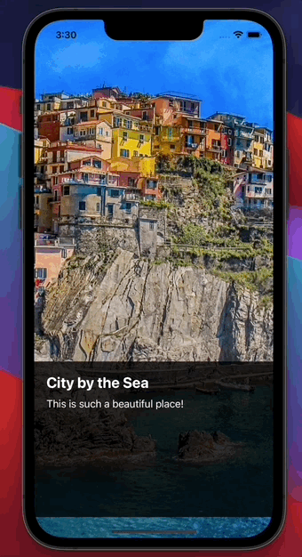  

  ### Layou2 app
  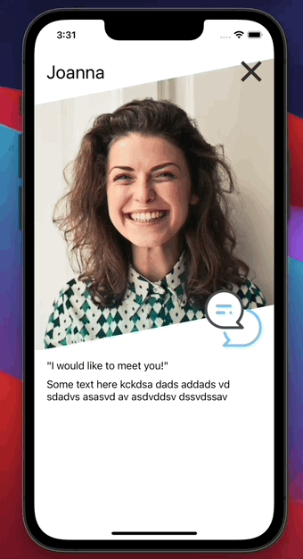   

  ### Fitness app
     

  ### Social Squid app
  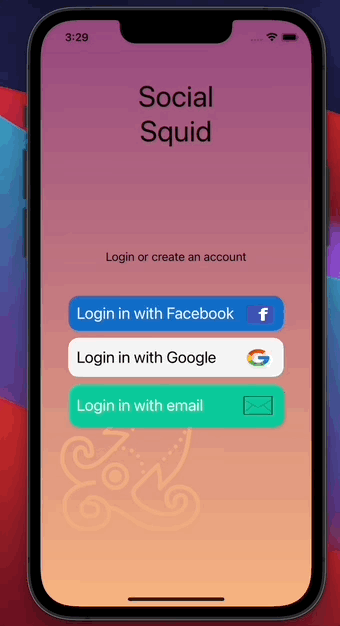   
  

## Card Wars - simple user/CPU game with a lot of fun!

  
Click to expand details!

  My first bigger app was made with the help of this course.  
  This is a classic card war game. The purpose of this game is to compare card and user/CPU with bigger card wins.  
  Cards are being shown randomly as in real life.   
  The user needs to press the "DEAL" button to start a new round. App automatically shows a card for user and CPU and gives a point to the winner.  
  Besides using StackView in layout, I have made IBOutlet and IBActions make it works.  
  Take a look at details in the project 👀. 
  ### Cards war game
 
    
  

## Guessing picture - guess where are the same picture!

  
Click to expand details!

  Classic game where the user has to find the same pictures.  
  Each of the cards is upside down, by pressing on its the user can temporarily show the front of the card.  
  However, when she/he presses on the second card and the card aren't the same both of them are put upside-down once again.  
  Of course, when the user guesses two cards correctly there are being removed from the rest.  
 The goal of the game is to guess all the cards before time runs out. BE QUICK!  
  
  In this project I have used:
  - timer to measure time (it is working even when user is scrolling)
  - AVFoundation to play sounds
  - CollectionView
  - delegate and datasource for CollectionView
  - CocoaTouch classes

  ### Cards war game
  demo:  
     
  
  game over:  
     
  
  game won:  
     

## Star Wars Delegate-Protocol - app to show how delegate-protocol works!

  
Click to expand details!

  This app is based on turoial* which helped me to understand how delegating in Swift works.  
  Delegate - Protocol is similar to master - slave.  
  FirstScreen (just showing something) is slave and SecondScreen(know information from user and send it to first screen) is master.  
  Base on the picked side (in SecondScreen) we are showing specific data back on the FirstScreen.  
  In the and we can use the function in the FirstScreen when arguments to it come from this function being called in SecondScreen.    
  
  [*link to the tutorial](https://youtu.be/DBWu6TnhLeY)
  
  ### Demo:
 
    
  

## Quiz app - parsing JSON into a quiz!

  
Click to expand details!

  Quiz app that uses JSON to create the whole quiz.  
  The user has to click on the right answer and then the user's choice is being checked.  
  If it's the right answer user gets a point and if he/she is wrong there's no point.  
  After all question popup window with a score and restart button is being shown.  
  If users close this app, the state of the game is being saved and loaded using UserDefaults.    
  
  What I ahve learned and applied in this app:
  - delegate / protocol patern
  - JSON decoding and parsing
  - Networking used to dowload JSON
  - TableView
  - UserDefaults
  - basic animations
  
  Please take a look at app and all its functionality:  
  
  ### Demo:
 
    
 
 ### Saving context:
 
    
 
 ### End of game:
 
    
  

## News app - using API to dowload news!

  
Click to expand details!

  News app is an app that help user to find best news.    
  In this app I am using news API to fetch most important news for US (this could be changed).    
  The main screen of the app is just a TableView with title and photo (if exists) of every article.  
  The user can click on each article to open its full version via WebView.    
  
  What I ahve learned and applied in this app:
  - using API to download and data
  - performing segues and using NavigationController
  - using WebView
  - using activity indicator
  
  [news API link](https://newsapi.org/)  
  
  Please take a look at app and all its functionality:  
  
  ### Demo:
 
    
 
 ### Details:
 
    
 
  

  

# Databases 💾

## Firebase basics

  
Click to expand details!

  This app is just a project where I have been learning CRUD with Firebase.  
  I won't attach any gifs because all this app does is perform CRUD with no visual effects.  
  

## Journal App - Firebase powered app for saving and quering notes!

  
Click to expand details!

  Journal app for saving notes with help of Firebase.  
  I have been using Firebase methods to CRUD data and also created a basic UI. </bd>
  
  ### Demo:
 
 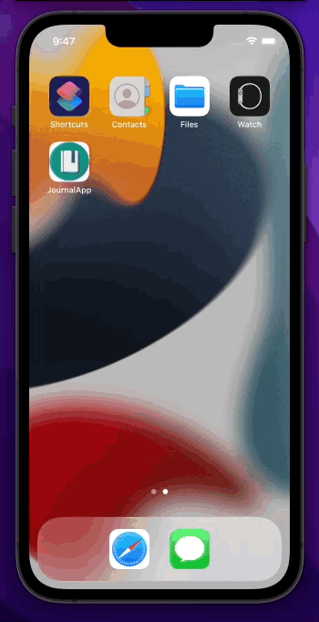   
  

## PhotoApp - UIImagepicker, Firebase auth and listeners

  
Click to expand details!

  In this app I have implemented:
  - authentication and login in with Firebase auth
  - uploading and downloading photos with Firebase storage
  - Taking pictures or picking pictures with UIImagepicker
  
  All of the functions mentioned above are shown on gifs:
  
  ### Creating a user:
 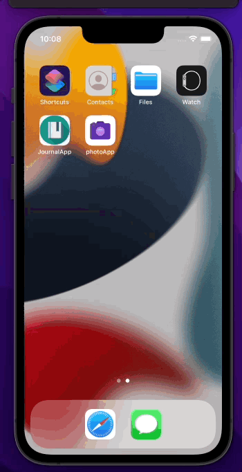   
 
  ### Log in:
 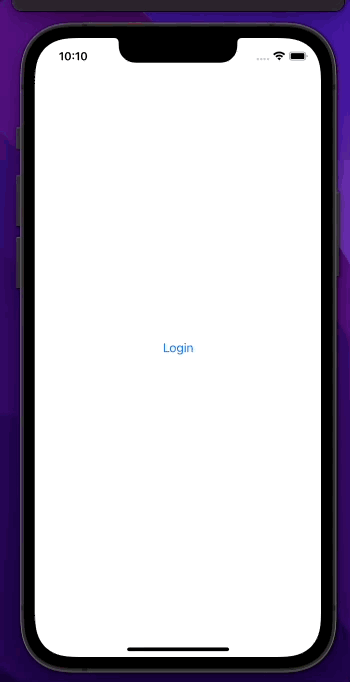   
 
 ### Upload a new photo:
    
 
 ### Sign out:
 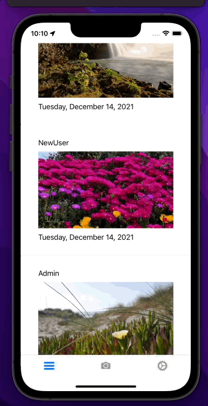   
 

## Guidebook App (CoreData) - Using CoreData as DB, MapView and mooooore!

  
Click to expand details!

  An app containing CoreData as database technology.  
  Users can view locations, add notes about them and see them in mapView.  
  All the data is being stored inside CoreData so users don't have to worry about losing data when the app will be closed.  
  
  ### Demo:
 
    
  

## Guidebook App (Realm) - upgraded verion of previous app now using Realm DB.

  
Click to expand details!

  In this app I have used Mongo DB Realm database.  
  Futhermore app works similar to previous verions with few upgrades.  
  User now can calculate route to the specyfic point or locate user.  
  
  ### Demo:
 
 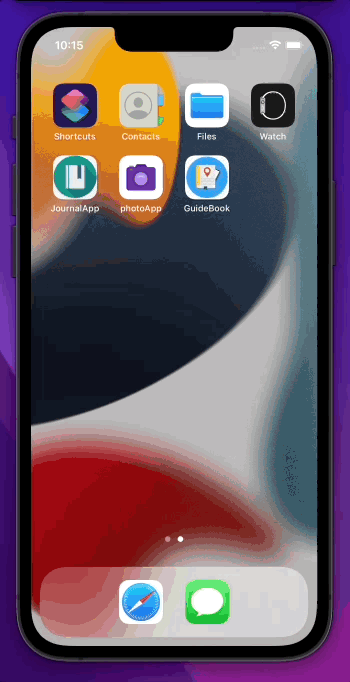   
 
 ### Route:
 
 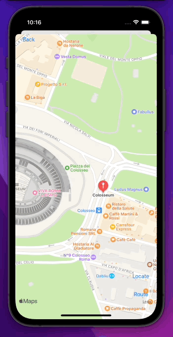   
  

# iOS App Design 

## MealApp - building iOS App with Figma design.

  
Click to expand details!

  The purpose of this project was to build an app from Figma UI design. </bd>
  The case of this app was to try to rebuild the app as it was designed in Figma.  
  Also besides building UI in Swift, I have learned the basics of UI.UX design and Figma.    
  
  Here are screeanshots of Figma design:  
  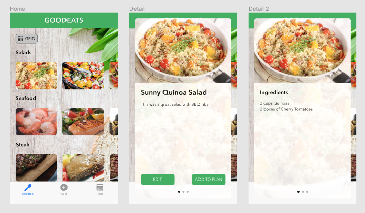   
  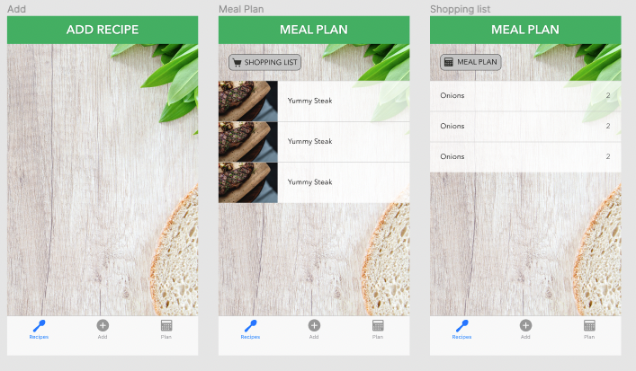   
  
  ### App Demo:
 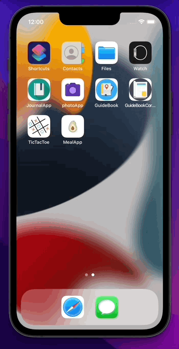   
  

